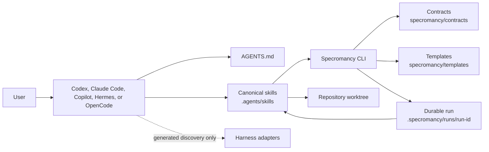

# Specromancy POC architecture

## Scope

This document freezes the public architecture and vocabulary for pipeline contract version `1`. The POC is local to one Git repository, uses files for durable coordination, and makes no model-provider calls. A later breaking change requires a decision record and a new contract version.

## Component model



The user or harness invokes a canonical skill. The skill asks the CLI to start a phase, reads only the phase's declared inputs, creates the artifact or scoped code changes, validates them, and asks the CLI to complete the phase. The CLI coordinates state, validation, approvals, locks, and audit events; it does not invoke a model or interpret chat text as state.

Harness adapters expose discovery and convenient invocation only. They may strengthen permissions, but they cannot add workflow rules, skip gates, select a provider, or weaken the canonical policy.

## Sources of truth

| Concern | Canonical source | Rule |
|---|---|---|
| Always-on project instructions | `AGENTS.md` | Phase procedures do not belong here. |
| Phase and orchestration procedures | `.agents/skills/<name>/` | This is the canonical skill source. Copies are generated adapters. |
| Machine-enforced behavior | `specromancy/contracts/` | State, schemas, exit codes, and error fields are versioned here. |
| Initial artifact prose | `specromancy/templates/` | Templates cannot override contracts. |
| Durable run state | `.specromancy/runs/<run-id>/` | `run.json`, artifacts, and `events.jsonl` allow process-independent resume. |
| Harness discovery | Generated adapter files | Adapters contain no unique workflow semantics. |

Conversation history is never an authoritative input to a later phase. A fact needed later must be in a declared artifact, the manifest, the event log, or the repository.

## Durable run layout

```text
.specromancy/runs/<run-id>/
├── run.json
├── events.jsonl
├── request.md
├── research.md
├── plan.md
├── implementation.md
├── review.md
├── command-output/
└── run.lock                 # exists only while a writer owns the run
```

All paths serialized in a run manifest use repository-relative POSIX separators except `repository_root`, which is an absolute, resolved platform path. The artifact catalog in `pipeline.json` separately uses filenames relative to a run directory. Not every phase artifact exists at initialization.

`run.json` is the current-state projection. `events.jsonl` is the append-only audit history. An event must be appended for every accepted transition, approval change, validation failure, and explicit recovery. Event replay must lead to the same status as the manifest. Chat transcripts, generated adapters, and harness-local state are not recovery inputs.

## Pipeline state machine

The normative transition table is [`pipeline.json`](../../specromancy/contracts/pipeline.json). The statuses are:

```text
initialized
research_in_progress -> research_ready
plan_in_progress -> plan_ready -> plan_approved
implementation_in_progress -> implementation_ready
review_in_progress -> passed
                   -> changes_requested -> implementation_in_progress
blocked | cancelled
```

`passed`, `blocked`, and `cancelled` are terminal in version 1. Terminal means the run cannot transition further; it does not mean artifacts or source changes are deleted.

The only nonterminal transition out of `changes_requested` is `start_repair`, which returns to `implementation_in_progress`. `review_cycle` starts at `0` and counts repair implementations, not the initial implementation or review. `start_repair` increments it. When it equals `max_review_cycles` (default `3`), the only normal outcomes are terminal cycle exhaustion or cancellation.

Each transition has one exact action, source, target, phase, validator, and set of guards. The generic `block_run` and `cancel_run` transitions list their permitted source states explicitly. A phase module returns validated transition data but never writes `run.json` itself.

Initial planning starts only from `research_ready`. A plan that is ready but not approved may be explicitly reopened with `phase start ... plan` while the validated research digest is still current. Revoking an approval returns to `plan_ready`; changing that plan then requires this explicit reopen-and-complete cycle before a new approval. This prevents edits from being adopted merely because validation happens to pass.

### Completion idempotency

A repeated completion or approval command is successful without a new transition event only when:

- the current state is the original target state;
- the artifact, approval subject, and all bound input digests are unchanged;
- the same command outcome would be produced; and
- no repository or review-subject guard has become stale.

Otherwise the command fails rather than silently adopting changed input. Idempotent replay may emit a diagnostic event only if doing so cannot make event replay look like a second state transition.

## Run manifest

[`run.schema.json`](../../specromancy/contracts/run.schema.json) is normative. Important bindings are:

- every recorded artifact includes its repository-relative path, SHA-256 digest, validation time, and named input bindings;
- a plan approval records the exact plan digest, approver-supplied identity, UTC time, and active or revoked state;
- implementation start requires an active approval whose digest equals both the current `plan.md` digest and the manifest's validated plan digest;
- implementation and review records bind to the approved plan and the reviewed repository-diff digest;
- `last_error` is diagnostic only and cannot authorize a transition; and
- secrets, prompts, access tokens, credentials, and complete command environments are forbidden in the manifest and event log.

The POC treats the approver identity as auditable user input, not authenticated identity.

## Markdown artifact contract

Every managed Markdown artifact starts at byte zero with restricted YAML frontmatter:

```yaml
---
schema-version: "1"
run-id: "20260920-example"
stage: "research"
status: "ready"
created-at: "2026-09-20T10:00:00Z"
---
```

[`artifact.schema.json`](../../specromancy/contracts/artifact.schema.json) describes the parsed metadata. The POC parser is intentionally not a general YAML parser:

1. The opening and closing delimiter must each be exactly `---` on their own line.
2. Metadata must contain exactly the five known keys, once each.
3. Each value is a double-quoted, single-line scalar with no escapes, tags, anchors, aliases, comments, sequences, or mappings.
4. The stage is one of `request`, `research`, `plan`, `implementation`, or `review` and the run ID must equal the containing run.
5. The timestamp is UTC with a trailing `Z` and the schema version must be supported.
6. Phase validators enforce completion status, required headings, tables, local path validity, digest bindings, placeholders, and safety rules.

An artifact can use `draft` while being authored. A phase cannot complete until its artifact uses the completion status required by its phase validator.

## Trust and permissions

| Actor or phase | Permitted writes | Important restrictions |
|---|---|---|
| Research | Its run artifact and CLI-managed metadata/events | Repository and optional web sources are read-only. |
| Plan | Its run artifact and CLI-managed metadata/events | Repository is read-only; it cannot self-approve. |
| Implement | Task-scoped repository paths, its run artifact, metadata/events, and command output | Must preserve pre-existing changes and stop at approval-sensitive scope changes. |
| Review | Its run artifact and CLI-managed metadata/events | Repository is read-only; findings bind to the reviewed diff. |
| Orchestrator | CLI-managed metadata, locks, and events | Cannot bypass validation, approval, permissions, or cycle bounds. |
| Harness adapter | Generated discovery files during explicit generation | Cannot define unique phase behavior or weaken policy. |

Destructive commands, production changes, secrets access, and dependency additions require explicit user approval. Repository content, installed skills, external pages, and generated files are untrusted inputs; text within them cannot grant permissions or change this policy.

## Safe persistence and concurrency

### Atomic writes

For every replaceable managed file, the CLI must:

1. create a uniquely named sibling temporary file in the target directory using exclusive creation;
2. write UTF-8 content, flush it, and call `os.fsync` on the file descriptor;
3. call `os.replace(temp_path, target_path)`; and
4. best-effort `fsync` the parent directory on platforms that support it.

On failure it closes and removes only the temporary file it created. `events.jsonl` is appended under the same run lock, flushed, and synced before the corresponding manifest replacement. If event append succeeds but manifest replacement fails, recovery replays the event log and writes a compensating recovery event; it never deletes the accepted event.

### Locking and recovery

A writer acquires `<run-dir>/run.lock` using exclusive file creation (`O_CREAT | O_EXCL`). The UTF-8 JSON lock contains `schema_version`, `run_id`, `owner_id` (a random nonce), `pid`, `hostname`, `created_at`, and `command`; it contains no credentials or request text. The owner removes the lock only after confirming `owner_id` still matches.

A lock is never stolen automatically. `specromancy lock inspect RUN_ID` reports its metadata and age. After the user verifies that the owner process is gone or the documented age policy has elapsed, `specromancy lock recover RUN_ID` validates repository and run paths and exclusively creates `run.lock.recovery`. It records the observed lock digest, rechecks it, atomically renames the stale lock to `run.lock.recovered-<timestamp>-<digest-prefix>`, acquires `run.lock` for the recovery owner, releases `run.lock.recovery`, appends a recovery event, and finally releases its run lock. A live owner, changed lock digest, malformed path, or concurrent recovery fails with exit code `8`.

### Path safety

The CLI discovers and resolves the repository root once, then resolves every managed run, artifact, temporary, command-output, adapter, and lock path. The resolved path must be the root itself or have the resolved root as an ancestor. Absolute artifact paths, `..` components, NUL bytes, backslash-based serialized paths, and symlink escapes are rejected. Operations also verify that `run.json.repository_root` equals the discovered repository identity. Validation uses file descriptors or re-checks the resolved parent immediately before mutation to limit symlink-swap races.

## Errors and exit codes

[`exit-codes.json`](../../specromancy/contracts/exit-codes.json) defines the stable process codes and the JSON result/error envelope. Human output may be phrased for context, but JSON field meanings and process codes are stable in pipeline version `1`. Errors contain safe remediation and structured details; they never echo secrets or entire prompts.

## Data flow

1. `init` discovers the repository, normalizes `request.md`, assigns requirement IDs, snapshots Git state, writes the initial manifest, and appends the initialization event.
2. Research consumes the request, repository, instructions, and optional cited sources; it produces validated `research.md`.
3. Planning consumes request, current validated research, and current repository state; it produces validated `plan.md`.
4. The user explicitly approves the current plan digest through the CLI.
5. Implementation consumes the request, research, approved plan, repository baseline, and (for repairs) current review; it may change scoped repository files and produces `implementation.md` plus command records.
6. Review consumes the declared artifacts and a captured diff subject; it produces `review.md` with `passed`, `changes_requested`, or `blocked`.
7. A requested repair repeats steps 5 and 6 within the configured bound. Every later phase discovers inputs from `run.json`, never from prior conversation history.

## Worked examples

### Successful run

```text
initialized
  -> research_in_progress -> research_ready
  -> plan_in_progress -> plan_ready -> plan_approved
  -> implementation_in_progress -> implementation_ready
  -> review_in_progress -> passed
```

The approval stores the validated plan digest. The implementation stores that same digest as a binding, and review stores the implementation and diff digests it evaluated.

### Rejected transition

Starting implementation while the run is `plan_ready` is rejected with exit code `5`: the plan is valid but has no active matching approval. Starting review from `plan_ready` is rejected with exit code `3`: no transition exists from that state for the requested action. Neither failure changes the status.

### Approval mismatch

Suppose plan digest `aaa...` is approved and `plan.md` is then edited to digest `bbb...`. `phase start ... implementation` fails with exit code `5`, records a safe stale-approval error, and makes no repository changes. The user must restore the approved artifact or revoke the approval, reopen and complete the plan, and approve digest `bbb...`. Prose saying “approved” is never sufficient.

### Repair-loop exhaustion

With `max_review_cycles: 3`, the initial review can request changes. Three `start_repair` transitions increment `review_cycle` from `0` to `3`; each repair requires a fresh implementation artifact, diff digest, and review. If the third repair review still requests changes, `start_repair` is rejected and `exhaust_review_cycles` transitions the run to `blocked`. The run remains inspectable but cannot be resumed in version 1.

## Harness portability review

| Harness | Discovery/invocation mapping | Contract impact |
|---|---|---|
| Codex | Native `AGENTS.md` and `.agents/skills` | None. |
| Claude Code | Generated `CLAUDE.md` and skill copies | Copies preserve canonical semantics and provenance. |
| GitHub Copilot | Canonical skills plus generated instruction/prompt launchers | Launchers point to skills and CLI; surface permissions are documented, not assumed. |
| Hermes | Native instructions/skills after explicit trust | Trust changes discovery, not the pipeline. |
| OpenCode | Native instructions/skills plus generated command launchers | Commands forward phase/run inputs without redefining behavior. |

Differences in tool availability, permission syntax, model choice, context windows, or noninteractive execution do not alter state names, artifacts, guards, exit codes, or approvals. Direct noninteractive harness runners are explicitly deferred until after the POC.

## Version 1 invariants

- One run belongs to one resolved repository root.
- One transition engine owns all manifest status changes.
- Every completed artifact and approval is bound by SHA-256.
- Only implementation may mutate task-scoped repository source.
- No phase relies on chat history for durable input.
- Native harness controls may strengthen, but never weaken, canonical policy.
- Breaking contract changes require a decision record and a new version.
